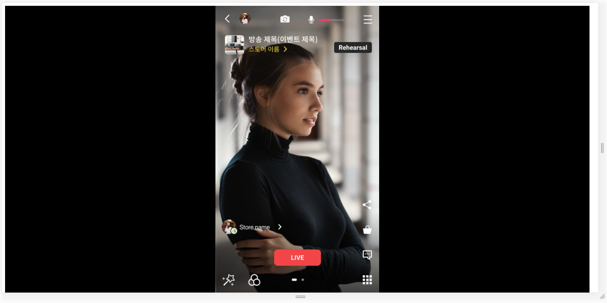
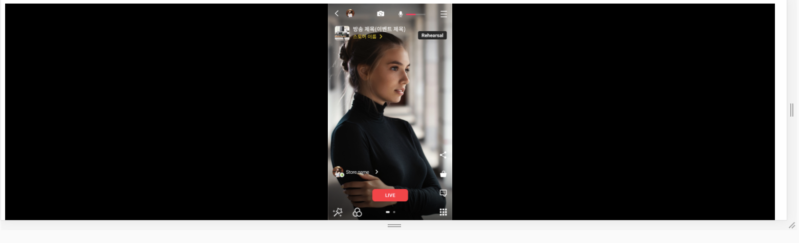

## 요구사항
**참고** 요구사항의 순서는 난이도와 상관이 없음.

### 소스 코드 및 파일 구조 변경 관련(필독)
* `src/page` 내 모든 파일들의 이름을 변경하거나 삭제하는 것을 허용하지 않습니다.
* `src/component/*-live.event.tsx`의 이름을 변경하거나 삭제하는 것을 허용하지 않습니다.
* `src/client/http-client.ts`의 이름을 변경하거나 삭제하는 것을 허용하지 않습니다.
* 그 외 요구사항을 만족하는 한도 내에서 코드 변경을 허용합니다. ex) `src/hooks` 폴더 생성 및 모듈 작성
* 해당 내용을 위반하였을 경우 채점상 불이익을 받을 수 있습니다.

### 1. API 요청 클라이언트 구현(`http-client.ts`)
* `HttpClient`를 사용하여 api 클라이언트를 구현해주세요.
  * 해당 클래스의 인스턴스는 단 하나만 존재 할 수 있도록 합니다.
  * 해당 class를 사용하지 않고 api를 요청했을 경우 채점상 불이익을 받을 수 있습니다.
* API 리스트는 [API 문서](API.md) 를 참고해주세요.
  
### 2. 이벤트 대시보드 구현(`live-event-dashboard.tsx`)
이벤트 카드는 다음과 같은 세가지 종류의 카드가 들어있습니다. 각 이벤트 카드에는 이벤트랑 연관된 상품 리스트가 존재합니다.
* 방송 대기중인 이벤트 카드 - `component/scheduled-event-card.tsx`
* 방송 중인 이벤트 카드 - `component/live-event-card.tsx`
* 방송 종료된 이벤트 카드 - `component현/finished-event-card.tsx`

이벤트 대시보드에서는 다음과 같은 요구사항이 존재합니다.

* 이벤트 리스트 목록은 항상 서버로부터 받아와야 합니다. `[GET] /live-event` 로 불러와야 합니다.
* 이벤트 카드는 이벤트의 방송 상태에 따라 적절한 위치와 컴포넌트로 보여주어야 합니다.
  * 방송 대기중인 이벤트 목록 - `ScheduledEventCard` 컴포넌트 사용
  * ex) 방송 대기중인 이벤트 카드의 '이벤트 방송하기' 버튼을 클릭했을 경우 해당 이벤트를 방송중인 이벤트로 이동
* 상품 리스트를 가져올 때에는 `[GET] /live-event/:id/product` 혹은 `[GET] /product`를 통해 불러와야 합니다.
* 카드 좌측 하단에 초록색 버튼 클릭 시 `[PUT] /live-event/:id` 을 호출하여 이벤트 상태를 변경시키고, 카드 위치를 `우측`으로 이동시켜야 합니다.
* 카드 좌측 하단 혹은 우측 하단에 빨간색 버튼 클릭 시 `[DELETE] /live-event/:id` 을 호출하여 이벤트를 삭제시켜야 합니다.
* 새로고침 후에도 이벤트 변경 내역이 반영되어있어야 합니다.


### 3. 이벤트 등록 구현(`live-event-creation-page.tsx`)
* 이벤트 대시보드 우측 상단에 `새 이벤트 생성하기` 버튼을 누르면 이벤트 등록 페이지로 이동됩니다.
* `상품 선택하기` 클릭 시 모달창이 나타나며 상품 리스트(`products`state)를 보여 주어야 합니다.
* 모달창에서 상품들을 체크 표시 했을 때 `setSelectedProducts()`가 호출됩니다. 선택된 상품들의 id 리스트가 `selectedProducts` state에 반영되어 있습니다.
* 상품 리스트를 가져올 때는 `[GET] /product` 를 통해 불러와야 합니다.
* Shopify polaris UI 문서를 읽고 다음과 같은 기능을 구현해주세요.
  * `ActionList` 컴포넌트에 선택 가능한 이벤트 상태 목록을 표시해주시고 목록 아이템 클릭 시 선택된 이벤트 상태를 state에 반영시켜주세요.
  * [ActionList 컴포넌트 문서](https://polaris.shopify.com/components/actions/action-list)
* 이벤트 등록 시 하단에 `이벤트 생성하기` 버튼 클릭시 `handleSubmit()` 이벤트가 발생합니다. 해당 함수에 들어갈 로직을 구현해주세요. 
* 이벤트를 등록하기 위해서는 `[POST] /live-event` 를 호출하셔야 합니다.


### 4. 라이브 방송 페이지 구현 (`live-shopping-page.tsx`)
* 이벤트 대시보드 우측 상단에 `라이브 쇼핑 페이지로 이동` 버튼을 누르면 이벤트 등록 페이지로 이동됩니다.
* css는 `style.css`만을 사용하여 수정할 수 있도록 합니다.
* 방송 화면의 비율은 9:16으로 브라우저 크기에 따라 비율이 유지된 채 줄어들거나 늘어날 수 있게 구현해주세요.
* `가산점 요소` 모바일 환경에서의 방송 화면이 어떻게 보여야할지 구현해주세요.




### 테스트 관련(가산점 요소)
* Test suite와 각 test 의 목적을 이해하기 쉽게 기술해주세요. 예를 들어,

```
isNumber test (x)
isNumber 함수는 number type 의 argument 를 받으면 True 를 리턴합니다. (o)
```

* 각 컴포넌트 내부에 있는 함수들이나, Util 함수들을 테스트 할 수 있게 분리합니다.
* 조건문이 있는 함수의 경우, edge case에 대한 테스트를 준비합니다.
* 테스트 코드 내에서 각 테스트마다 반복적으로 필요한 부분을 life cycle 함수를 이용해 관리하도록 합니다.

